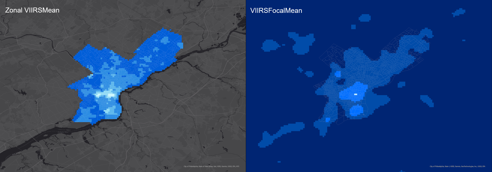
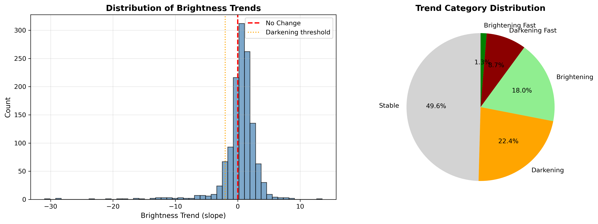
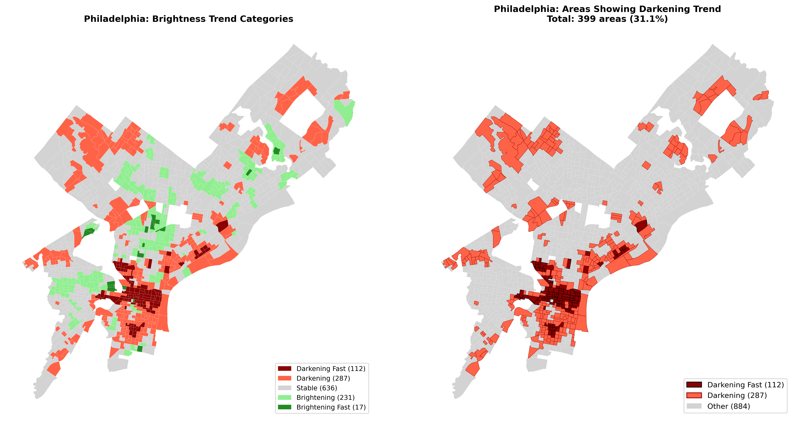

---
format:
  html:
    toc: false
execute:
  enabled: false
---

<!-- 导航栏 -->
<nav class="navbar">
  <span class="navbar-brand">UNEQUAL NIGHTS</span>
  <ul class="navbar-nav">
    <li class="nav-item"><a class="nav-link" href="index.html">Home</a></li>
    <li class="nav-item"><a class="nav-link" href="research.html">Research</a></li>
    <li class="nav-item"><a class="nav-link" href="data.html">Data</a></li>
    <li class="nav-item"><a class="nav-link" href="study_area.html">Study Area</a></li>
    <li class="nav-item"><a class="nav-link active" href="analysis.html">Analysis</a></li>
    <li class="nav-item"><a class="nav-link" href="findings.html">Findings</a></li>
    <li class="nav-item"><a class="nav-link" href="policy.html">Policy</a></li>
    <li class="nav-item"><a class="nav-link" href="https://github.com/YanyangChen-penn/Python_team_project" target="_blank">
      <svg xmlns="http://www.w3.org/2000/svg" width="20" height="20" viewBox="0 0 24 24" fill="none" stroke="currentColor" stroke-width="2" stroke-linecap="round" stroke-linejoin="round">
        <path d="M9 19c-5 1.5-5-2.5-7-3m14 6v-3.87a3.37 3.37 0 0 0-.94-2.61c3.14-.35 6.44-1.54 6.44-7A5.44 5.44 0 0 0 20 4.77 5.07 5.07 0 0 0 19.91 1S18.73.65 16 2.48a13.38 13.38 0 0 0-7 0C6.27.65 5.09 1 5.09 1A5.07 5.07 0 0 0 5 4.77a5.44 5.44 0 0 0-1.5 3.78c0 5.42 3.3 6.61 6.44 7A3.37 3.37 0 0 0 9 18.13V22"></path>
      </svg>
    </a></li>
  </ul>
</nav>

---

## Reclassification & Cost Surface

### Four Reclassified Layers

<div class="content-box">

**Methodology:** Each variable was reclassified to a standardized 1-5 scale using natural breaks classification, enabling direct comparison across different metrics.

**Python Integration:** VIIRS, 311, Crime, and Census data were first integrated into `philly_integrated_data.shp` using geopandas

**ArcGIS Processing:** Reclassify tool applied to each variable → Raster Calculator combined layers

</div>

---

### Layer 1: Darkness (VIIRS Inverted)

<iframe src="https://upenn.maps.arcgis.com/apps/instant/basic/index.html?appid=a9bc1f40780842a9adce27eadff36d14" width="100%" height="500" frameborder="0" style="border:0; border-radius: 8px;" allowfullscreen></iframe>

<div class="content-box content-box-blue">
**Darkness Score:** Higher values = darker areas (inverted VIIRS radiance)

**Range:** 0.000000 - 1.000000 reclassified to 1-5 scale

**Pattern:** Center City shows lowest darkness scores; North and Southwest Philadelphia show highest
</div>

---

### Layer 2: Low 311 Reporting

<iframe src="https://upenn.maps.arcgis.com/apps/instant/basic/index.html?appid=98642ec820b2435180d0ef11b482fb41" width="100%" height="500" frameborder="0" style="border:0; border-radius: 8px;" allowfullscreen></iframe>

<div class="content-box content-box-blue">
**Low Reporting Score:** Higher values = fewer complaints filed

**Range:** 0.000000 - 1.000000 reclassified to 1-5 scale

**Insight:** Areas with high darkness but low complaints indicate reporting gaps
</div>

---

### Layer 3: Low Income / Vulnerability

<iframe src="https://upenn.maps.arcgis.com/apps/instant/basic/index.html?appid=320d81f2f1bc49299f0aac19c7290415" width="100%" height="500" frameborder="0" style="border:0; border-radius: 8px;" allowfullscreen></iframe>

<div class="content-box content-box-green">
**Vulnerability Score:** Based on below-median household income

**Range:** 0.000000 - 1.000000 reclassified to 1-5 scale

**Pattern:** North Philadelphia and Southwest show highest vulnerability
</div>

---

### Layer 4: Crime Risk

<iframe src="https://upenn.maps.arcgis.com/apps/instant/basic/index.html?appid=43c2091f5d9848ef9d2f028bb59a2724" width="100%" height="500" frameborder="0" style="border:0; border-radius: 8px;" allowfullscreen></iframe>

<div class="content-box content-box-red">
**Crime Score:** Nighttime incident density (7pm-6am)

**Range:** 0.000000 - 1.000000 reclassified to 1-5 scale

**Correlation:** High crime areas often overlap with low lighting zones
</div>

---

## Weighted Cost Surface

### Layer 5: Integrated Risk Surface

<iframe src="https://upenn.maps.arcgis.com/apps/instant/atlas/index.html?appid=4bf61e9c47344b84b9b02a341f91528a" width="100%" height="500" frameborder="0" style="border:0; border-radius: 8px;" allowfullscreen></iframe>

<div class="content-box">

### Cost Surface Formula

**Raster Calculator:**

```
CostSurf_Risk = 
    0.30 × Darkness +
    0.30 × Crime +
    0.20 × Low311 +
    0.20 × LowIncome
```

**Interpretation:** Brighter colors = higher risk scores = priority intervention areas

**Pattern:** Risk concentrates in North Philadelphia, Kensington, and Southwest corridors

</div>

---

## Neighborhood Analysis: VIIRS Statistics

### Zonal and Focal Statistics Comparison

<div style="text-align: center; margin: 2rem 0;">

</div>

<div style="display: flex; gap: 20px; flex-wrap: wrap; margin: 2rem 0;">

<div style="flex: 1; min-width: 300px;">
<h4 style="color: var(--blue); text-align: center; text-decoration: underline;">Zonal_VIIRS_Mean</h4>
<div class="content-box content-box-blue">
Zonal Statistics tool calculated mean VIIRS radiance within each block group boundary. This aggregates satellite pixel values to census geography for statistical comparison.
</div>
</div>

<div style="flex: 1; min-width: 300px;">
<h4 style="color: var(--blue); text-align: center; text-decoration: underline;">VIIRSFocalMean</h4>
<div class="content-box content-box-blue">
Focal Statistics with circular neighborhood window smooths brightness values to reveal spatial patterns. Center City shows highest brightness; peripheral neighborhoods significantly darker.
</div>
</div>

</div>

<div class="callout">
<div class="callout-title">Key Finding: Center City is brightest; peripheral neighborhoods show significantly lower lighting levels</div>
</div>

---

## Complaint Gap Areas

### 62 Underserved Neighborhoods Identified

<iframe src="https://upenn.maps.arcgis.com/apps/instant/basic/index.html?appid=519e8551dc5c41c6b01533338394d95c" width="100%" height="500" frameborder="0" style="border:0; border-radius: 8px;" allowfullscreen></iframe>

<div class="feature-grid">

<div class="stat-card stat-card-red">
<span class="stat-number">62</span>
<span class="stat-label">Gap Areas Identified</span>
<p style="margin-top: 1rem; color: var(--text-muted);">Where darkness, low complaints, and low income overlap</p>
</div>

<div class="stat-card">
<span class="stat-number">$42,800</span>
<span class="stat-label">Average Income</span>
<p style="margin-top: 1rem; color: var(--text-muted);">38% below city average</p>
</div>

<div class="stat-card">
<span class="stat-number">0.31</span>
<span class="stat-label">Average VIIRS</span>
<p style="margin-top: 1rem; color: var(--text-muted);">65% darker than average</p>
</div>

<div class="stat-card">
<span class="stat-number">2.1</span>
<span class="stat-label">Complaints/km&sup2;</span>
<p style="margin-top: 1rem; color: var(--text-muted);">76% fewer than average</p>
</div>

</div>

### Gap Area Characteristics

<div class="content-box content-box-red">

**Three criteria overlap:**
1. **Low brightness** (VIIRS below threshold)
2. **Low complaints** (311 below city average)
3. **Low income** (Census below median)

**Identified with:** Python spatial analysis using `geopandas` on Zonal_VIIRS_Mean output

**Critical Pattern:** The darkest areas file 76% fewer complaints. These are also the lowest-income neighborhoods. **This means the 311 system systematically misses the communities that need help most.**

</div>

---

## Temporal Trend Analysis: Darkening Areas

### 399 Block Groups Showing Darkening Trend

<div class="feature-grid">

<div class="stat-card stat-card-blue">
<span class="stat-number">399</span>
<span class="stat-label">Areas Showing Darkening Trend</span>
<p style="margin-top: 1rem;">31.1% of Philadelphia block groups</p>
</div>

<div class="stat-card stat-card-orange">
<span class="stat-number">112</span>
<span class="stat-label">Darkening Fast</span>
<p style="margin-top: 1rem;">8.7% with rapid brightness decline</p>
</div>

<div class="stat-card stat-card-green">
<span class="stat-number">636</span>
<span class="stat-label">Stable Areas</span>
<p style="margin-top: 1rem;">49.6% with no significant change</p>
</div>

</div>

### Brightness Trend Distribution

<div style="text-align: center; margin: 2rem 0;">

</div>

### Spatial Distribution of Darkening Areas

<div style="text-align: center; margin: 2rem 0;">

</div>

### Trend Analysis Methodology

<div class="content-box content-box-blue">

**Algorithm:** Linear Regression Slope Analysis (scipy.stats.linregress)

**Data Period:** 2022-2024 VIIRS satellite observations

**Method:** For each block group, we calculated the slope of brightness values over time

**Trend Classification:**

| Category | Slope Threshold | Count | Percentage |
|----------|-----------------|-------|------------|
| Darkening Fast | slope < -2 | 112 | 8.7% |
| Darkening | -2 ≤ slope < 0 | 287 | 22.4% |
| Stable | 0 ≤ slope < 2 | 636 | 49.6% |
| Brightening | 2 ≤ slope < 5 | 231 | 18.0% |
| Brightening Fast | slope ≥ 5 | 17 | 1.3% |

</div>

<div class="callout callout-danger">
<div class="callout-title">Key Finding</div>

**31.1% of Philadelphia block groups are experiencing declining lighting levels** based on 2022-2024 VIIRS satellite observations. 

The 112 "Darkening Fast" areas represent the highest priority for infrastructure intervention.

Streetlights date to the 1970s. Our 2022-2024 data captures the critical transition before the city's $91M LED replacement project (launched Aug 2023).

</div>

---

## Safe Path Analysis

### Network-Based Routing with Risk Weighting

<iframe src="https://upenn.maps.arcgis.com/apps/instant/basic/index.html?appid=36ad38f0e1b843f7b5ba37c1ba34afc2" width="100%" height="500" frameborder="0" style="border:0; border-radius: 8px;" allowfullscreen></iframe>

### Route Analysis Results

<div class="content-box content-box-green">

**52 routes analyzed** between key Philadelphia locations:
- City Hall
- Temple University  
- 30th Street Station
- University City
- Chinatown
- Major transit hubs

**Methods:**
- **ArcGIS:** Distance Accumulation + Optimal Path
- **Python:** OSMnx + NetworkX for street-level routing with risk-weighted edges

</div>

<div class="stat-card stat-card-green" style="max-width: 500px; margin: 2rem auto;">
<div style="font-size: 1.5rem; color: var(--green); margin-bottom: 1rem;">TRADE-OFF</div>
<span class="stat-number">+1-3%</span>
<span class="stat-label">Distance Increase</span>
<div style="font-size: 2rem; margin: 1rem 0;">=</div>
<span class="stat-number">Up to 20%</span>
<span class="stat-label">Safer Routes</span>
</div>

<div class="callout callout-success">
<div class="callout-title">Key Finding</div>

**Chinatown route shows greatest risk reduction**

By accepting a small distance penalty (1-3% longer), travelers can reduce their exposure to high-risk areas by up to 20%.

</div>

---

## Technical Implementation Notes

<div class="callout">
<div class="callout-title">Workflow Summary</div>

1. **Python (geopandas):** Integrated VIIRS, 311, Crime, Census → `philly_integrated_data.shp`

2. **ArcGIS Reclassify:** Standardized each variable to 1-5 scale

3. **ArcGIS Raster Calculator:** Combined layers → `CostSurf_Risk`

4. **ArcGIS Spatial Analysis:** Zonal Statistics + Focal Statistics

5. **Python Analysis:** Identified Complaint Gap areas using spatial overlay

6. **scipy.stats:** Calculated brightness trends using linear regression slope

7. **OSMnx + NetworkX:** Generated risk-weighted safe routes

</div>

---

## Next Steps

Continue to [Findings](findings.html) to see policy recommendations and conclusions.
